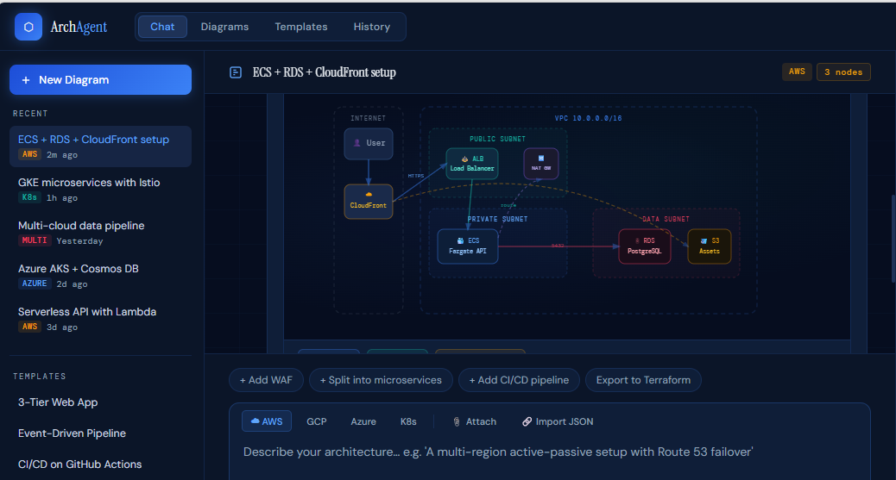

# Arch Agent 🏗️

A cloud architecture diagram assistant powered by the Claude API. Describe your infrastructure in plain English and get interactive architecture diagrams instantly.



## Features

- Generate cloud architecture diagrams from natural language descriptions
- Supports AWS, GCP, Azure, and multi-cloud architectures
- Download diagrams as SVG or PNG
- Clean, dark-themed chat interface

## Tech Stack

- **Backend:** Node.js + Express
- **Frontend:** Vanilla HTML/CSS/JS
- **AI:** Anthropic Claude API

## Getting Started

### Prerequisites

- [Node.js](https://nodejs.org/) v18+
- Anthropic API key — get one at [console.anthropic.com](https://console.anthropic.com)

### Installation

```bash
git clone https://github.com/ngranir/arch-agent.git
cd arch-agent
npm install
```

### Configuration

Edit the `.env` file and add your API key:

```
ANTHROPIC_API_KEY=your_api_key_here
PORT=3000
```

### Run

```bash
node server.js
```

Open [http://localhost:3000](http://localhost:3000) in your browser.

## Project Structure

```
arch-agent/
├── server.js        # Express server + Claude API proxy
├── package.json
├── .env             # API key (not committed)
└── public/
    └── index.html   # Frontend UI
```

## License

MIT
